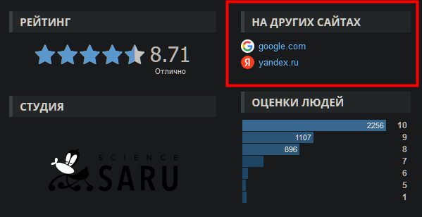

# Описание
Расширение для сайта <a href="https://shikimori.one/">Shikimori</a>, которое заменяет содержимое блока `НА ДРУГИХ САЙТАХ` на ваши поисковые системы.



<a href="https://github.com/ivanmem/shikimori-search-extension/releases">Скачать для Chrome или Firefox</a>

<a href="https://addons.mozilla.org/ru/firefox/addon/advanced-search-on-shikimori/">Установить в Firefox</a>

### Папки

- `src` - основной источник.
  - `contentScript` — скрипты и компоненты, которые будут внедрены как `content_script`
  - `background` - скрипты для фона.
  - `компоненты` — автоматически импортированные компоненты Vue, которые доступны во всплывающем окне и на странице параметров.
  - `styles` - стили, используемые во всплывающем окне и на странице настроек.
  - `assets` — активы, используемые в компонентах Vue.
  - `manifest.ts` — манифест расширения.
- `extension` - корень пакета расширения.
  - `assets` — статические активы (в основном для `manifest.json`).
  - `dist` — встроенные файлы, также служат заглушкой для Vite при разработке.
- `scripts` - вспомогательные скрипты разработки и комплектации.

### Разработка

```bash
pnpm dev
```

Затем **загрузите расширение в браузер с папкой `extension/`**.

Разработчики Firefox могут вместо этого запустить следующую команду:

```bash
pnpm dev-firefox
```

`web-ext` автоматически перезагружает расширение при изменении файлов `extension/`.

> В то время как Vite в большинстве случаев обрабатывает HMR автоматически, [Extensions Reloader](https://chrome.google.com/webstore/detail/fimgfedafeadlieiabdeeaodndnlbhid) по-прежнему рекомендуется для более чистой жесткой перезагрузки.

### Сборка

Чтобы собрать расширение, запустите

```bash
pnpm build
```

А затем упакуйте файлы в «расширение», вы можете загрузить `extension.crx` или `extension.xpi` в соответствующее хранилище расширений.