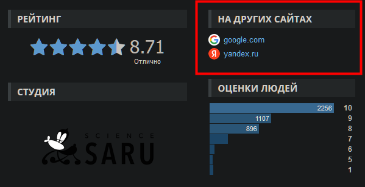

# Описание
Скрипт для сайта <a href="https://shiki.one/">Shikimori</a>, который заменяет содержимое блока `НА ДРУГИХ САЙТАХ` на ваши поисковые системы.



Основной способ установки — **пользовательский скрипт для Tampermonkey** (или другого менеджера пользовательских скриптов). Браузерные расширения для Chrome и Firefox по-прежнему поддерживаются, но их сборки выпускаются лишь по необходимости.

<a href="https://github.com/ivanmem/shikimori-search-extension/releases">Скачать (userscript, Chrome, Firefox)</a>

<a href="https://addons.mozilla.org/ru/firefox/addon/advanced-search-on-shikimori/">Установить в Firefox</a>

### Возможности

- Кнопки поиска названия аниме/манги в ваших поисковых системах и на трекерах прямо в блоке `НА ДРУГИХ САЙТАХ`.
- Добавление своих сайтов: если ссылка не содержит `{{s}}`, путь поиска подбирается автоматически.
- Редактирование и удаление сохранённых ссылок, значки сайтов для наглядности.
- Настройки поведения:
  - закреплять раздел ссылок вверху страницы;
  - скрывать стандартные ссылки Шикимори;
  - отключить расширение целиком.

### Папки

- `src` — исходный код.
  - `userscript` — точка входа и обёртка пользовательского скрипта (Tampermonkey).
  - `contentScripts` — скрипты и компоненты, внедряемые на страницы Shikimori.
  - `sidepanel` — панель настроек (используется и в модалке userscript).
  - `popup`, `options`, `background` — части браузерного расширения.
  - `platform` — прослойки для разных платформ (расширение / userscript): хранилище, вкладки и т.п.
  - `components` — автоматически импортируемые компоненты Vue.
  - `composables`, `logic`, `utils`, `common` — переиспользуемая логика и вспомогательные функции.
  - `styles`, `assets` — стили и ресурсы.
  - `manifest.ts` — манифест расширения.
- `extension` — корень пакета расширения.
  - `assets` — статические ресурсы (в основном для `manifest.json`).
  - `dist` — собранные файлы, также служат заглушкой для Vite при разработке.
- `scripts` — вспомогательные скрипты разработки и комплектации.

### Разработка

Пользовательский скрипт (основной вариант):

```bash
pnpm dev-userscript
```

Браузерное расширение:

```bash
pnpm dev
```

Затем **загрузите расширение в браузер с папкой `extension/`**.

Разработчики Firefox могут вместо этого запустить следующую команду:

```bash
pnpm dev-firefox
```

`web-ext` автоматически перезагружает расширение при изменении файлов `extension/`.

> В то время как Vite в большинстве случаев обрабатывает HMR автоматически, [Extensions Reloader](https://chrome.google.com/webstore/detail/fimgfedafeadlieiabdeeaodndnlbhid) по-прежнему рекомендуется для более чистой жесткой перезагрузки.

### Сборка

Пользовательский скрипт (основной вариант):

```bash
pnpm build-userscript
```

Готовый файл скрипта можно установить в Tampermonkey.

Браузерные расширения (собираются по необходимости):

```bash
pnpm build         # Chrome
pnpm build-firefox # Firefox
```

А затем упакуйте файлы в «расширение», вы можете загрузить `extension.crx` или `extension.xpi` в соответствующее хранилище расширений.
